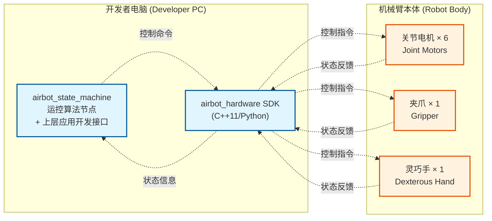

# AIRBOT-Play-硬件驱动库
AIRBOT Play Hardware 
# 概述

AIRBOT Play 机械臂控制 SDK 提供两套开发接口：

- **airbot_hardware**：底层硬件驱动库，提供机械臂电机的直控和反馈，用户可以使用此接口开发自己的运动控制算法、运动规划算法、数据采集和 VLA 算法推理等等
- **airbot_state_machine**：上层应用开发接口，用户可以在机械臂预先安装的运动控制算法基础上，利用上层应用开发接口开发自己的软件业务功能，例如自主抓取等等

## 通讯架构图
下图呈现了开发者电脑与机械臂本体的系统组成及交互关系。开发者电脑部分涵盖运控算法节点和软件业务逻辑实现模块，通过上层应用开发接口airbot_state_machine和airbot_hardware的数据通讯控制机械臂本体的运动。机械臂本体由6个关节电机和夹爪组件构成，主控电脑负责软件运行。



## 通讯流程说明

**控制指令流程：**
1. `airbot_state_machine` 生成控制指令
   
2. `airbot_hardware SDK` 转换为硬件控制命令  
   
3. 控制关节电机、夹爪、灵巧手

**状态反馈流程：**
1. 硬件组件返回状态信息
   
2. `airbot_hardware SDK` 处理状态数据
   
3. `airbot_state_machine` 接收状态用于算法决策


## 支持的硬件配置

| 机械臂类型 | 电机配置 | 末端执行器 | 自由度 |
|------------|----------|------------|--------|
| Play (6轴) | OD×3 + DM×3 | 无 | 6 |
| Play (6轴) | OD×3 + ODM×3 | 无 | 6 |
| PlayWithEEF (7轴) | OD×3 + DM×3 | G2夹爪 | 7 |
| PlayWithEEF (7轴) | OD×3 + DM×3 | E2夹爪 | 7 |
| Replay (7轴) | EC×6 | E2夹爪 | 7 |

## 电机类型说明

| 电机类型 | 说明 | 适用关节 |
|----------|------|----------|
| OD | 求之自研一代电机 | 关节1-3 |
| DM | 达妙电机（新协议） | 关节4-6 |
| ODM | 达妙电机（旧协议） | 关节4-6 |
| EC | 编码器 | 所有关节 |


## 电机控制模式说明

| 控制模式 | 功能描述 | 适用场景 |
|----------|----------|----------|
| MIT | 位置-速度-力矩复合控制，支持前馈力矩和PID参数调节 | 精确力控制、阻抗控制 |
| PVT | 位置-速度-时间控制，支持最大速度和力矩限制 | 轨迹跟踪、路径规划 |
| CSV | 纯速度控制 | 速度控制、连续运动 |
| CSP | 纯位置控制 | 位置控制、点到点运动 |

## 开发流程

1. **安装SDK包**（C++或Python）
2. **创建执行器实例**
3. **创建机械臂/电机实例**
4. **初始化硬件**
5. **启用硬件**
6. **发送控制命令**
7. **获取状态反馈**
8. **清理资源**


# 开发环境配置

- **操作系统**：Ubuntu 20.04 或更高版本
- **Python版本**：Python 3.8 或更高版本（如果使用SDK则必需）
- **CPU**： ≥ 4 核（推荐用于实时控制和仿真）
- **显存**：≥ 8 GB（推荐 ≥ 10 GB 以运行 pi0 算法推理，≥ 16 GB 以运行 DISCOVERSE 仿真器）
- **存储空间**：≥5GB可用磁盘空间用于操作系统、软件和数据
- **USB端口**：确保有足够的USB端口以连接任何外部设备或外围设备（推荐大于 3 个USB端口以运行 ALOHA / Mobile ALOHA 算法）

## 软件安装与使用

软件包请进入联络技术支持团队获取。解压后，您将看到以下软件包：

- AIRBOT Play 硬件驱动库 `airbot-hardware` （.deb或.whl）

建议使用conda环境，若使用conda：
- 创建conda环境：
```bash
conda create -n airbot python=3.12
```
- 且要保证pip路径正确:
```bash
which pip
```
输出如下路径：
```bash
/home/hunter/miniconda3/envs/airbot/bin/pip
```

### C++

#### 系统环境

**编译器要求** ： GCC版本需要高于9.4.0

**系统依赖** ： 

```bash
sudo apt-get install libcap-dev
```

#### SDK安装与使用

1. **安装SDK包**
```bash
# 安装airbot_hardware开发包 请根据上位机内核版本、系统版本选择对应的whl包。
sudo dpkg -i airbot_hardware_*.deb
```

2. **配置开发环境**
```bash
# 在CMakeLists.txt中添加
find_package(airbot_hardware REQUIRED)
target_link_libraries(your_target airbot_hardware)
```

3. **包含头文件**
```code
#include "airbot_hardware/executors/executor.hpp"
#include "airbot_hardware/handlers/arm.hpp"
#include "airbot_hardware/handlers/motor.hpp"
#include "airbot_hardware/handlers/eef.hpp"
```

### Python

**Python版本要求**：Python 3.8+

#### SDK安装与使用

1. **安装Python wheel包**
```bash
# 安装airbot_hardware开发包 请根据上位机内核版本、系统版本选择对应的whl包。
pip install airbot_hardware_py-*.whl
```

2. **导入模块**
```python
import airbot_hardware_py as ah
```


### ROS2

该模块为 `example/cpp` 的 ROS2 接口实现，通过 ROS2 的话题（Topic）发布/订阅机制，可便捷控制 AIRBOT Play 机械臂及其相关组件（E2、G2）。

#### 依赖环境
- ROS2 Jazzy
- airbot_hardware（硬件驱动）
- boost 库

#### 快速部署

编译例程如下
```bash
cd example/ros2
colcon build --packages-select airbot_hardware_ros2
```

运行例程如下
```bash
# 加载环境变量
source install/setup.bash

# 运行指定例程（以 can0 为例）
ros2 run airbot_hardware_ros2 <例程名> --ros-args -p i:=can0
```

**示例**：运行位置速度控制例程
```bash
ros2 run airbot_hardware_ros2 airbot_play_pos_ctrl --ros-args -p i:=can0
```
